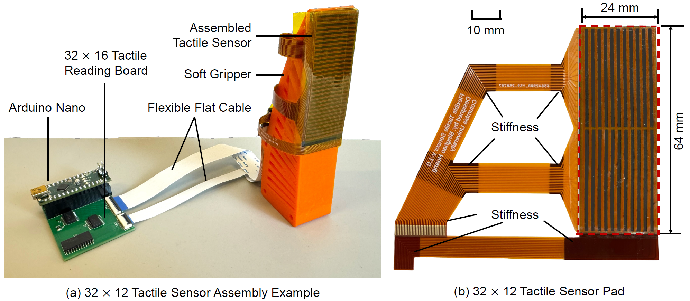

# FlexiTac: An Open-Source, Scalable Tactile Solution for Robotic Systems

**Authors:**  
Binghao Huang¹, Yunzhu Li¹  
¹Columbia University

FlexiTac is an open-source, scalable tactile sensing platform designed to make touch sensing more accessible for robotics. It supports flexible sensor fabrication, real-time tactile readout, and integration into manipulation systems such as grippers, robot arms, and tactile skins. The broader FlexiTac project also includes hardware tutorials, simulation support, and system design examples for robotic applications. 
Project website: https://flexitac.github.io/




## Overview

This repository contains the hardware-side code and examples for reading FlexiTac tactile sensors, including:

- Arduino firmware for tactile data acquisition
- Python visualization for real-time tactile readout


## Hardware Description

A FlexiTac sensor is scanned row-by-row and column-by-column by the microcontroller, then streamed to the host computer over serial.

In the current fast example:

- tactile resolution: **16 × 32**
- serial baud rate: **2,000,000**
- frame format: **2-byte header + 512 data bytes**
- frame header: `0xAA 0x55`
- data type: **8-bit unsigned values**

The provided Python script initializes a baseline from the first few frames, subtracts the baseline, applies thresholding and normalization, and displays the tactile response as a heatmap.


## Installation and Running Example

### 1. Upload the Arduino firmware

Open `32_16_fast.ino` in the Arduino IDE, select the correct board and serial port, and upload it to the microcontroller.

After uploading, the board should appear as a serial device such as:

```bash
/dev/ttyUSB0
```


### 2. Install Python dependencies

Install the required Python packages:

```bash
pip install numpy pyserial opencv-python scipy
```

### 3. Check the serial port

Verify the device path on your machine:

```bash
ls /dev/ttyUSB*
```


If needed, update the port in the Python script:

```python
PORT = "/dev/ttyUSB0"
```

### 4. Linux serial permission if needed

If you do not have permission to access the serial device, run:

```bash
sudo chmod 777 /dev/ttyUSB*
```

### 5. Run the example

Start the Python visualizer with:

```bash
python3 fast_32_16.py
```

## 🏷️ License
FlexiTac © 2026 by Columbia University is licensed under CC BY-NC 4.0. To view a copy of this license, visit https://creativecommons.org/licenses/by-nc/4.0/


##  Acknowledgment
We thank Yu-Wei Chao, Jie Xu, Yiyue Luo, Devin Murphy, Xinyue Zhu, Jimmy Wang, Irving Fang, Yixuan Wang, Hanxiao Jiang, Kaifeng Zhang, Changyi Lin, Xuhui Kang, Yuhao Zhou, Haonan Chen, Xinyi Yang, Yunxi Zhu, Naian Tao, Mingtong Zhang, Baoyu Li, and Rao Fu for their valuable discussions and support.